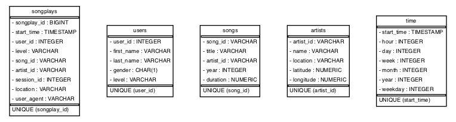

# Data Engineer Nanodegree - Project 1: Data modeling with PostgreSQL

- [Data Engineer Nanodegree - Project 1: Data modeling with PostgreSQL](#data-engineer-nanodegree---project-1-data-model-with-postgresql)
  - [Overview](#overview)
  - [Dataset](#dataset)
    - [Song dataset](#song-dataset)
    - [Log dataset](#log-dataset)
  - [Schema](#schema)
    - [Fact table](#fact-table)
    - [Dimension Tables](#dimension-tables)
  - [Project Files](#project-files)
  - [How to run](#how-to-run)
    - [1. PostgreSQL](#1-postgresql)
    - [2. Requirements](#2-requirements)
    - [3. Create tables](#3-create-tables)
    - [4. ETL](#4-etl)
    - [5. Test and inspect](#5-test-and-inspect)
  - [Reference](#reference)

## Overview
In this project, we apply Data Modeling with Postgres and build an ETL pipeline using Python. A startup wants to analyze the data they've been collecting on songs and user activity on their new music streaming app. Currently, they are collecting data in json format and the analytics team is particularly interested in understanding what songs users are listening to.

## Dataset
The project is based on two dataset.
### Song dataset
It's a subset of real data from the [Million Song Dataset](https://labrosa.ee.columbia.edu/millionsong/). Each file is in JSON format and contains metadata about a song and the artist of that song. 

Sample Record:

    ```json
    {
        "num_songs": 1,
        "artist_id": "ARJIE2Y1187B994AB7",
        "artist_latitude": null,
        "artist_longitude": null,
        "artist_location": "",
        "artist_name": "Line Renaud",
        "song_id": "SOUPIRU12A6D4FA1E1",
        "title": "Der Kleine Dompfaff",
        "duration": 152.92036,
        "year": 0
    }
    ```
### Log Dataset
It consists of log files in JSON format generated by this [Event Simulator](https://github.com/Interana/eventsim) based on the songs in the dataset above. These simulate activity logs from a music streaming app based on specified configurations.

Sample Record:

    ```json
    {
        "artist": null, 
        "auth": "Logged In", 
        "firstName": "Walter", 
        "gender": "M", 
        "itemInSession": 0, 
        "lastName": "Frye", 
        "length": null, 
        "level": "free", 
        "location": "San Francisco-Oakland-Hayward, CA", 
        "method": "GET","
        page": "Home", 
        "registration": 1540919166796.0, 
        "sessionId": 38, 
        "song": null, 
        "status": 200, 
        "ts": 1541105830796, 
        "userAgent": "\"Mozilla\/5.0 (Macintosh; Intel Mac OS X 10_9_4) AppleWebKit\/537.36 (KHTML, like Gecko) Chrome\/36.0.1985.143 Safari\/537.36\"", 
        "userId": "39"
    }
    ```
## Schema


### Fact table
**Songoplays** - records in log data associated with song plays i.e. records with page `NextSong`
| Column name | Type      | Properties        |
| ----------- | --------- | ----------------- |
| songplay_id | BIGSERIAL | PK, AUTOINCREMENT |
| start_time  | timestamp |                   |
| user_id     | int       |                   |
| level       | varchar   |                   |
| song_id     | varchar   |                   |
| artist_id   | varchar   |                   |
| session_id  | int       |                   |
| location    | varchar   |                   |
| user_agent  | varchar   |                   |

### Dimension Tables
**Songs** - songs in music database
| Column name | Type    | Properties |
| ----------- | ------- | ---------- |
| song_id     | varchar | PK         |
| title       | varchar |            |
| artist_id   | varchar |            |
| year        | int     |            |
| duration    | numeric |            |

**Artists** - artists in music database
| Column name | Type    | Properties |
| ----------- | ------- | ---------- |
| artist_id   | varchar | PK         |
| name        | varchar |            |
| location    | varchar |            |
| latitude    | numeric |            |
| longitude   | numeric |            |

**Users** - users in the app
| Column name | Type    | Properties |
| ----------- | ------- | ---------- |
| user_id     | varchar | PK         |
| firsname    | varchar |            |
| lastname    | varchar |            |
| gender      | char    |            |
| level       | varchar |            |

**Time** - timestamps of records in  **songplays**  broken down into specific units
| Column name | Type      | Properties |
| ----------- | --------- | ---------- |
| start_time  | timestamp | PK         |
| hour        | int       |            |
| day         | int       |            |
| week        | int       |            |
| month       | int       |            |
| year        | int       |            |
| weekday     | int       |            |


## Project Files

```sql_queries.py``` -> contains sql queries for dropping and  creating fact and dimension tables. Also, contains insertion query template.

```create_tables.py``` -> contains code for setting up database. Running this file creates **sparkifydb** and also creates the fact and dimension tables.

```etl.ipynb``` -> a jupyter notebook to analyse dataset before loading. 

```etl.py``` -> read and process **song_data** and **log_data**

```test.ipynb``` -> a notebook to connect to postgres db and validate the data loaded.

```create_schema_graph.py``` -> utility to create a database schema diagram png.

```requirements.txt``` -> list of dependency libraries.

```docker-compose.yml``` -> Docker file to run Postgres on localhost

## How to run

### 1. PostgreSQL
In order to run this project you must have a PostgreSQL database configured in your localhost with:
- a user "student"
- a db calles "sparkify"

If you don't have it available, you can use Docker Compose to easly create and configure it. Simply execute these commands from the root of the project:
```bash
docker-compose build
docker-compose run
```
### 2. Requirements
Be sure to have all requirements satisfied executing:
```
pip install -r requirements.txt
```
### 3. Create tables
Then, create tables using the `create_tables.py` Python script.

### 4. ETL
Now, you are ready to run the etl process executing the `etl.py` script.

### 5. Test and inspect

You can test to read and write data into tables by `etl` notebook:
```
jupyter notebook
```
This will open the Jupiter interface. Open the `etl.ipynb` notebook and start querying the db.

You can inspect the results of the etl process with the `test` notebook:
```
jupyter notebook
```
This will open the Jupiter interface. Open the `test.ipynb` notebook and start querying the db.
## Reference: 
[Psycopg](http://initd.org/psycopg/docs/)

[PostgreSQL Documentation](https://www.postgresql.org/docs/)

[Pandas Documentation](https://pandas.pydata.org/pandas-docs/stable/)
